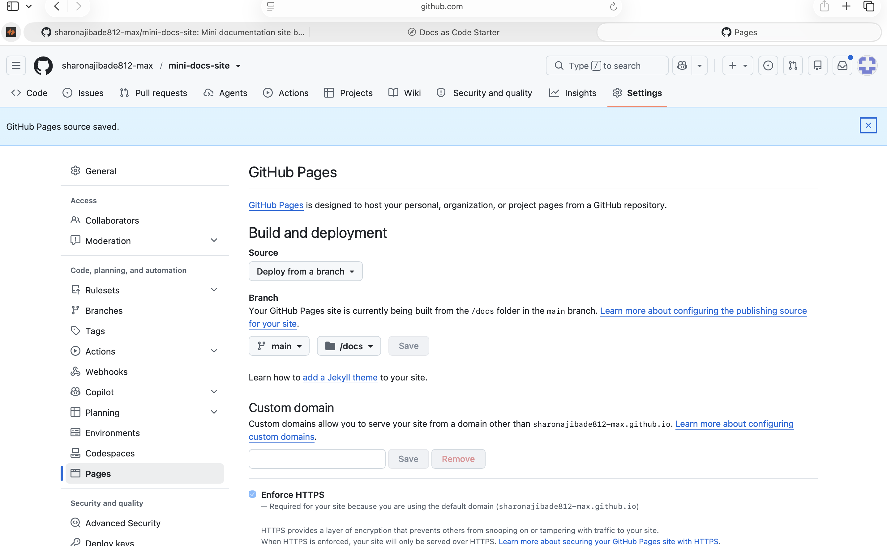

GitHub Pages turns the files in a repository into a public website at no cost. This guide covers publishing a Quarto site, picking up after your articles are written and your repository exists.

## What You Need

- A Quarto project with a `_quarto.yml` file (see [Rendering with Quarto](quarto-render.qmd))
- A public GitHub repository (see [VS Code and GitHub](vscode-github.qmd))
- GitHub Desktop installed

## 1. Send Output to a docs Folder

GitHub Pages publishes from either the top level of a repository or a folder named `docs`. Add this line to your `_quarto.yml` so Quarto puts the finished site where Pages can find it:

```yaml
project:
  type: website
  output-dir: docs
```

## 2. Render the Whole Site

Open a terminal in your project folder and run:

```bash
quarto render
```

Leave off the file name this time. With a `_quarto.yml` present, Quarto builds every page in the project and reports the output as `docs/index.html`.

To check the result before publishing, run:

```bash
open docs/index.html
```

## 3. Commit and Push

Open GitHub Desktop and confirm the repository name at the top left. The file list will be long, because it includes every generated page, stylesheet, and script in the `docs` folder.

Write a short summary such as "Add site files, articles, and images," click **Commit to main**, then click **Push origin**.

## 4. Turn On GitHub Pages

On github.com, open your repository and click **Settings**, then **Pages** in the left menu.

Under **Build and deployment**, the Source dropdown may already say **GitHub Actions**. Change it to **Deploy from a branch**, which is the simpler option for a site you render yourself. Then set the branch to **main** and the folder to **/docs**, and click **Save**.

{fig-alt="The GitHub Pages settings screen showing Source set to Deploy from a branch, with main and /docs selected."}

## 5. Confirm the Deployment

Deployment takes a minute or two. To check it, open the **Actions** tab or your repository's deployments page. A green checkmark next to `github-pages` means the site is live, and the URL appears beneath it.

Your site address follows this pattern:

```
https://USERNAME.github.io/REPOSITORY-NAME/
```

## Updating the Site Later

Editing an article takes three steps: change the `.qmd` file, run `quarto render` again, then commit and push. GitHub Pages redeploys automatically within a minute or two.

## Common Problems

- **Only the README appears.** The folder is set to root instead of `/docs`.
- **Workflow cards appear instead of branch dropdowns.** The Source is still set to GitHub Actions.
- **Changes do not show up.** You pushed the `.qmd` files without running `quarto render`, so the HTML in `docs` is still the old version.