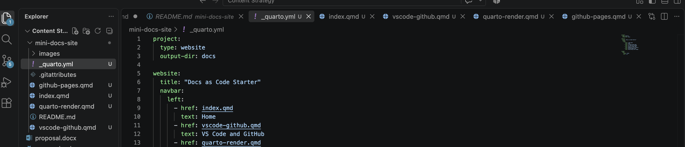

{fig-alt=""}

This site collects three short guides for anyone setting up a documentation workflow for the first time. Each one covers a step I worked through myself while learning these tools, and together they move from installing an editor to publishing a live site.

## Articles

### [VS Code and GitHub](vscode-github.qmd)

How to install a text editor, create a GitHub account, and publish your first repository.

### [Rendering with Quarto](quarto-render.qmd)

How to turn a Markdown file into a Word document or a web page using a single command.

### [Publishing with Pages](github-pages.qmd)

How to take a Quarto site from your computer to a public URL using GitHub Pages.