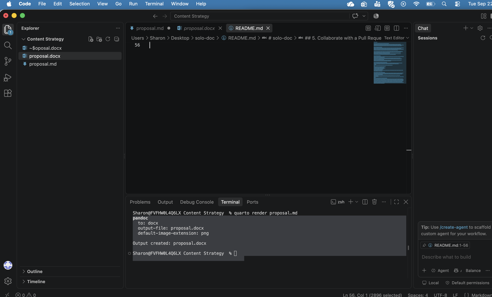

Quarto takes a plain Markdown file and turns it into a Word document, a PDF, or a web page using a single command. This guide covers the Word conversion, which is useful when you want to draft in Markdown but submit a `.docx`.

## What You Need

- [VS Code](https://code.visualstudio.com/) installed, with a project folder open (see [VS Code and GitHub](vscode-github.qmd))
- [Quarto](https://quarto.org/docs/get-started/) installed
- A Markdown file to convert

## 1. Set the Output Format

Quarto reads instructions from a block at the very top of your file, marked off by three dashes on either side. This is called YAML, and it tells Quarto what to produce.

```yaml
---
title: "Your Document Title"
author: "Your Name"
format: docx
---
```

Change `format: docx` to `format: html` if you want a web page instead. Indentation matters in YAML, so paste this block rather than retyping it.

## 2. Open a Terminal

The terminal is where you type the render command. In VS Code, open the **Terminal** menu at the top of your screen and choose **New Terminal**. A panel opens along the bottom of the window with a blinking cursor.

## 3. Run the Render Command

Type this and press Enter, replacing `yourfile.md` with your own file name:

```bash
quarto render yourfile.md
```

If your file name contains spaces or parentheses, wrap it in quotation marks.

When it works, the terminal ends with a line reading `Output created:` followed by the new file name.

{fig-alt="The VS Code terminal showing the message Output created, followed by the new file name."}

## 4. Open the Result

The new file appears in the same folder as your Markdown source. Clicking it in the VS Code sidebar shows a message saying the file is binary and cannot be displayed. That is expected, because a `.docx` is not plain text. Right-click the file, choose **Reveal in Finder**, and open it from there.

## 5. Add Images to Your Project

Images belong in a folder inside your project, usually named `images`. To move one in without leaving VS Code, open the **File** menu, click **Open**, and select the image. Its name appears as a tab at the top of the editor. Drag that tab down onto the `images` folder in the sidebar.

Then reference it in your Markdown using the folder name and file name:

```markdown
{fig-alt="Description for screen readers."}
```

## Common Problems

- **`quarto: command not found`** means Quarto is not installed. Install it from [quarto.org](https://quarto.org/docs/get-started/), then close and reopen VS Code.
- **Nothing happens after the command.** Check that you are in the right folder. The terminal shows the current folder name before the cursor.
- **The image does not appear.** Confirm the file sits inside `images`, and that the name in your Markdown matches exactly, including capitals.