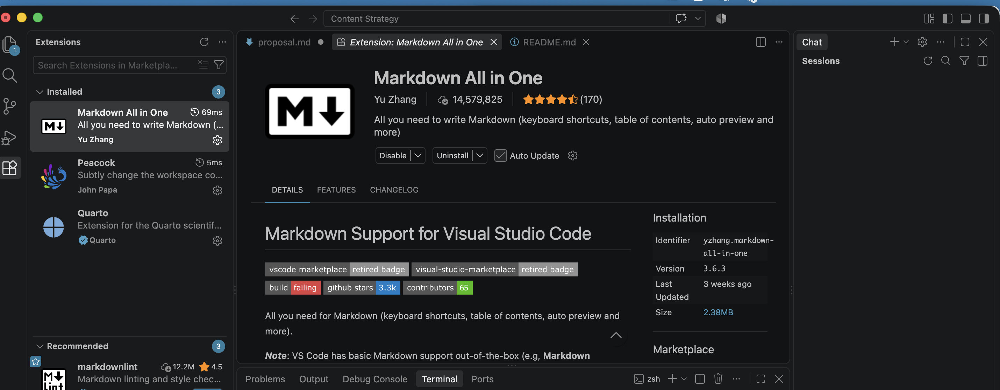

This guide will help you set up the basic tools you need to create, manage, collaborate on, and publish documentation. You do not need prior coding experience. The goal is to understand the basic workflow rather than memorize every step.

## 1. Install VS Code

[Visual Studio Code](https://code.visualstudio.com/) is a text editor that makes it easier to work with Markdown, HTML, and other plain-text files. Download and install the version for your operating system. If you are using an Iowa State laptop, admin settings may block the installer, so download it from Self Service instead.

After installing VS Code, open the **Extensions** panel and install an extension such as **Markdown All in One**. Extensions add features to VS Code without requiring you to install a different program. See [VS Code's extension documentation](https://code.visualstudio.com/docs/configure/extensions/extension-marketplace) if you need help.

{fig-alt="The VS Code Extensions panel showing search results for Markdown All in One."}

## 2. Create a Project Folder

Every project lives in a folder on your computer. Create one wherever you keep your coursework, then open it in VS Code: click **File**, then **Open Folder**, and select your new folder.

Opening the folder rather than a single file matters, because the sidebar then shows only that project, and any new file you create lands inside it.

To add a file, right-click the folder name in the sidebar and choose **New File**. Type the name with its extension, such as `notes.md`, and press Enter. The file opens empty on the right, ready for you to paste or type your content.

## 3. Set Up GitHub

Create a free account at [GitHub](https://github.com/) and install [GitHub Desktop](https://desktop.github.com/). GitHub stores repositories online, while GitHub Desktop gives you a visual interface for managing them. This lets you use version control without relying entirely on command-line Git. GitHub's [Hello World tutorial](https://docs.github.com/en/get-started/using-github/hello-world) explains the basic concepts.

## 4. Create and Publish a Repository

Create a **public repository** and open it in GitHub Desktop. At the top level, create a file named `index.html`. Add a link back to your repository:

```html
<a href="YOUR-REPOSITORY-URL">Link to repository</a>
```

Save the file. In GitHub Desktop:

1. Review your changed files.
2. Write a short commit message.
3. Click **Commit to main**.
4. Click **Push origin**.

A **commit** records a version of your work. **Pushing** sends those commits from your computer to GitHub.

## 5. Publish Your Work

GitHub Pages turns files in a repository into a public website. For the full process, see [Publishing with Pages](github-pages.qmd).

## 6. Collaborate with a Pull Request

Use your repository's **Settings → Collaborators** area to invite another person. Ask them to make a small change on a separate branch and submit a **pull request**. A pull request lets someone propose a change without immediately altering the main version of the project. Review their change, approve it, and merge it into `main`. See GitHub's guide to [creating pull requests](https://docs.github.com/en/pull-requests/collaborating-with-pull-requests/proposing-changes-to-your-work-with-pull-requests/about-pull-requests).